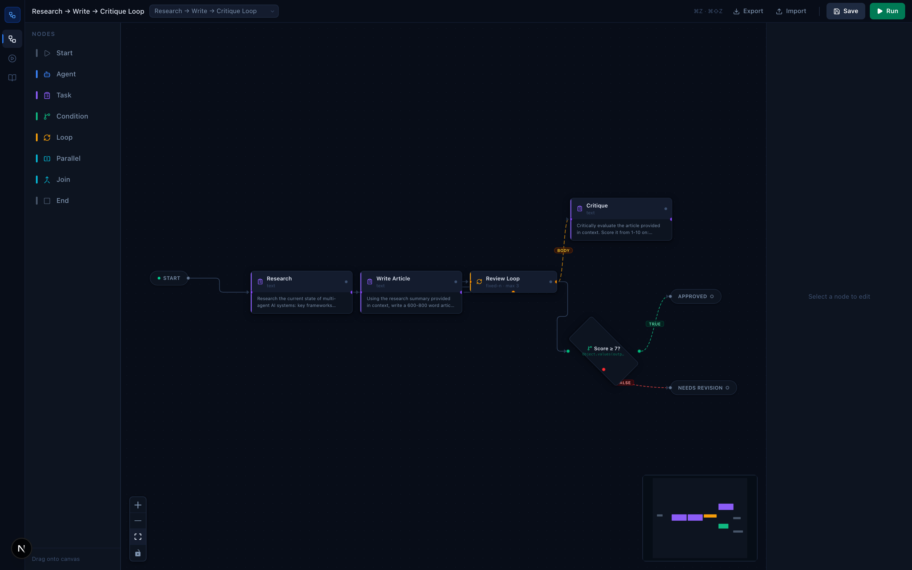
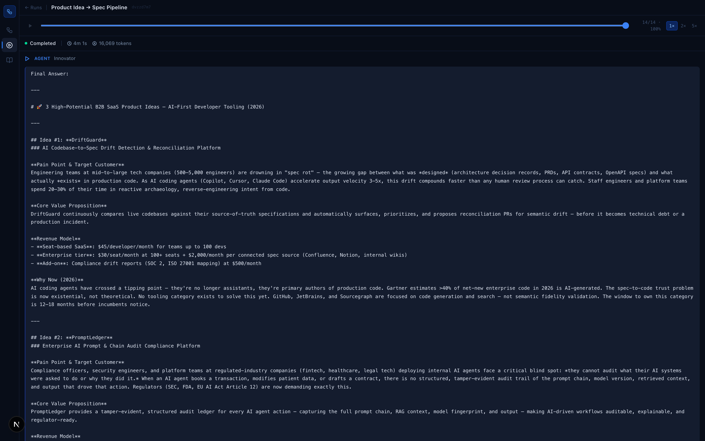
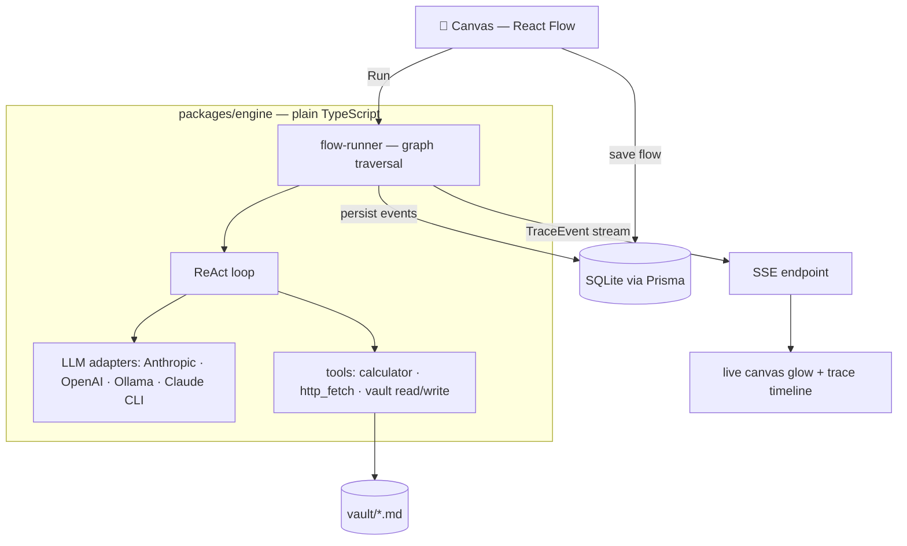
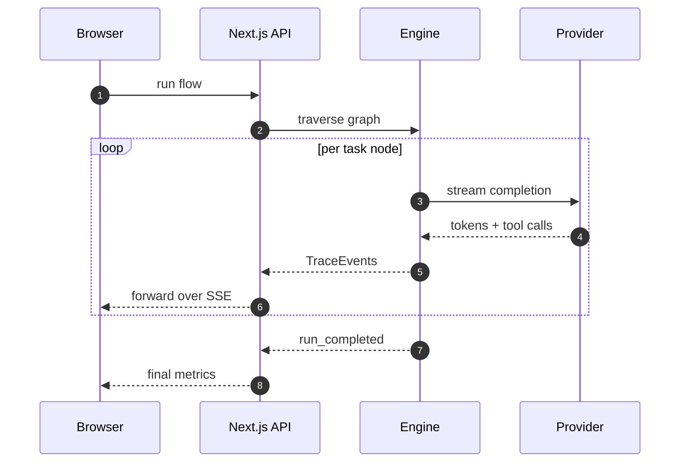
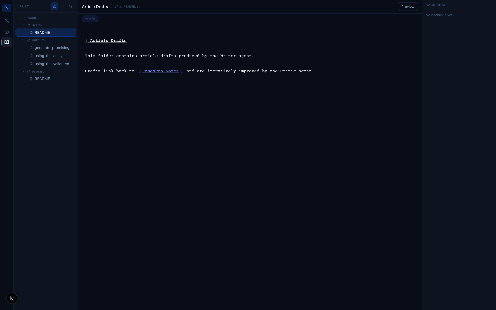

# agent-canvas

**Design multi-agent AI workflows on a canvas. Run them with live streaming. Watch agents write their knowledge into a linked markdown vault.**

No LangChain. No CrewAI. The execution engine is ~2,000 lines of plain TypeScript you can read in an afternoon — the engine *is* the framework.



## What it does

- 🎨 **Visual flow builder** — drag agents, tasks, loops, conditions, and parallel branches onto a React Flow canvas; wire them up; hit Run
- ⚡ **Live streaming execution** — every LLM token, tool call, and routing decision streams to the UI over SSE; nodes glow as they execute
- 🔁 **Real control flow** — fixed/while/until loops, JS-expression condition routing, parallel fan-out with join, agent-to-agent delegation
- 📓 **Markdown knowledge vault** — agents read and write real `.md` files with `[[wikilinks]]`; browse them in an Obsidian-style editor with backlinks and a graph view
- 🧑‍⚖️ **Human-in-the-loop** — pause any task for approve / edit / reject before the LLM runs
- ⏪ **Run replay** — scrub through any completed run event-by-event at 1×/2×/5×
- 🔌 **Provider-agnostic** — Anthropic API, Claude CLI, OpenAI, or fully offline with Ollama; swap per-agent, no code change



## Quickstart

Prereqs: Node ≥ 20, pnpm ≥ 9, and an Anthropic API key (or a local [Ollama](https://ollama.com) for offline use).

```bash
git clone https://github.com/myUdav4iik/agent-canvas.git
cd agent-canvas
pnpm install

# Configure — add your ANTHROPIC_API_KEY
cp .env.example apps/web/.env

# Create the SQLite database and seed the example flows
pnpm --filter web db:push
pnpm --filter web db:seed

# Run
pnpm dev
# → http://localhost:3000/canvas
```

Load an example flow from the picker in the top bar and click **Run**.

## Example flows

The seed ships four ready-to-run flows (re-run `pnpm --filter web db:seed` any time to restore them):

| Flow | Demonstrates |
|---|---|
| **Research → Write → Critique Loop** | 3 agents, review loop, condition routing on the critic's verdict |
| **Code Review Loop** | Developer/reviewer iteration until `CODE_APPROVED` |
| **Product Idea → Spec Pipeline** | 4-agent sequential pipeline, spec auto-saved to the vault |
| **Pet Project & Startup Idea Generator** | Brainstorm → triage → curated build brief |

## How it works



Everything the engine does is expressed as a **TraceEvent** — a discriminated union of 19 event types (`packages/shared/src/types/trace.ts`) that is the single contract between engine and UI. Events stream to the browser live, persist to SQLite for replay, and drive the canvas node states.



Deeper dive: **[docs/ARCHITECTURE.md](docs/ARCHITECTURE.md)**.

## The vault

Agents persist knowledge as real markdown files (portable, git-friendly) indexed in SQLite for search, backlinks, and the graph view. Tasks with output format `markdown-note` auto-save their result as a note.



## Repository layout

```
agent-canvas/
├── packages/
│   ├── shared/          # Domain types + TraceEvent union (engine↔UI contract)
│   └── engine/          # Pure TS orchestrator — zero React/Next deps
│       ├── adapters/    # Anthropic, OpenAI, Ollama, Claude CLI
│       ├── orchestrator/# ReAct loop, flow-runner, loop/condition/parallel nodes
│       ├── memory/      # VaultFS, indexer, vault-context assembler
│       ├── tools/       # Registry + builtin tools
│       └── safety/      # RunContext — timeouts, kill switch, caps
└── apps/
    └── web/             # Next.js 15 + Prisma + SQLite
        ├── prisma/      # Schema + restorative seed
        └── src/
            ├── app/     # Pages + API routes (flows, runs, vault, SSE)
            ├── components/  # canvas/ runs/ vault/ ui/
            ├── stores/  # Zustand: canvas, run, vault
            └── lib/     # engine-client, run-bus (SSE fan-out), flow-convert
```

## Environment variables

Set in `apps/web/.env` (see `.env.example`):

| Variable | Required | Default | Description |
|---|---|---|---|
| `ANTHROPIC_API_KEY` | For Anthropic provider | — | `sk-ant-...` |
| `OPENAI_API_KEY` | For OpenAI provider | — | `sk-...` |
| `OLLAMA_BASE_URL` | For Ollama provider | `http://localhost:11434` | Local Ollama endpoint |
| `DATABASE_URL` | Yes | `file:../../data/dev.db` | SQLite path (relative to `apps/web/prisma/`) |
| `VAULT_DIR` | Yes | `../../vault` | Markdown notes directory |
| `MAX_DELEGATION_DEPTH` | No | `3` | Max nested agent delegation |
| `GLOBAL_RUN_TIMEOUT_MS` | No | `600000` | Per-run hard timeout |
| `MAX_LOOP_ITERATIONS` | No | `20` | Global loop iteration cap |

## Development

```bash
pnpm typecheck                  # tsc across all packages
pnpm --filter engine exec vitest run   # engine unit tests (62 tests)
pnpm harness                    # CLI ReAct loop — colored trace, no UI needed
node scripts/screenshots.mjs    # regenerate README screenshots (dev server must be running)
```

See **[CONTRIBUTING.md](CONTRIBUTING.md)** for conventions.

## License

[MIT](LICENSE)
